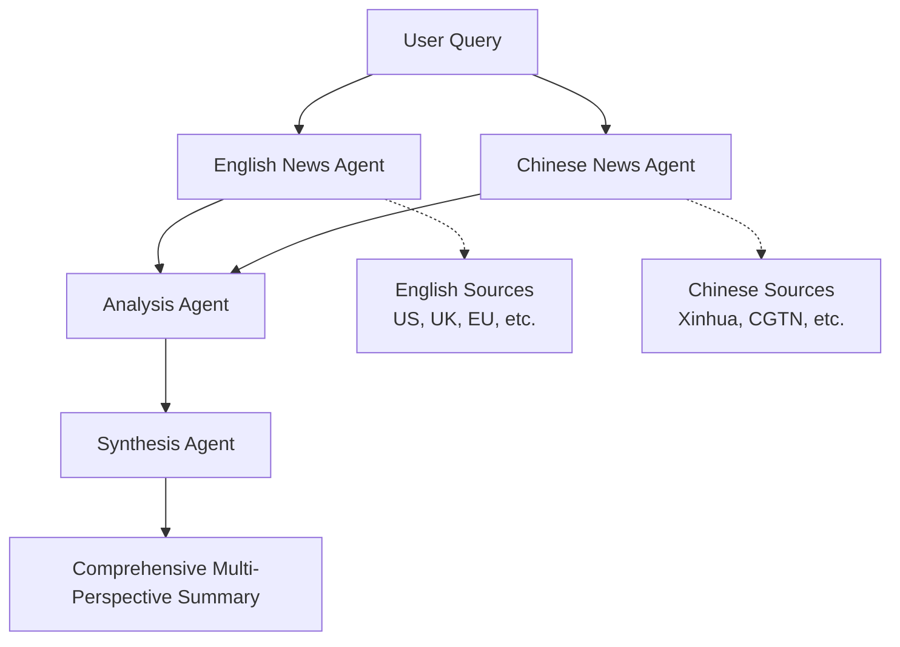

# Global News Room: Multi-Perspective News Analysis

A comprehensive news analysis system that delivers balanced, multi-perspective coverage by gathering insights from English and Chinese sources, analyzing different geopolitical viewpoints, and synthesizing comprehensive summaries highlighting global perspectives.

## 🌍 Overview

Today's news is often siloed by geography and ideology, with users rarely seeing all sides of important stories. The Global News Room workflow addresses this by:

1. **Gathering news from multiple sources**: Simultaneously collects coverage from English and Chinese-language outlets
2. **Cross-cultural analysis**: Identifies key disagreements and different framings between Western and Chinese perspectives  
3. **Synthesis**: Delivers a comprehensive summary that explicitly contrasts perspectives from key geopolitical actors
4. **Balanced reporting**: Highlights where sources agree, disagree, and what each side might be missing

## 🏗️ Architecture

The workflow uses **NVIDIA NIMs** (build.nvidia.com) with specialized models:

- **Llama Nemotron 70B**: For reasoning, analysis, and final synthesis
- **Llama 3.1 405B**: For Chinese content translation and processing
- **Tavily Search API**: For real-time news gathering from both English and Chinese sources

### Agent Workflow



## 🚀 Quick Start

### Prerequisites

1. **NVIDIA API Key**: Get from [build.nvidia.com](https://build.nvidia.com)
2. **Tavily API Key**: Get from [tavily.com](https://tavily.com) for web search
3. **Python 3.11+**

### Installation

```bash
# Clone and install the AIQ toolkit
git clone <repository>
cd aiagenthackathon

# Install the global news room workflow
cd global_news_room
uv pip install -e .

# Install AIQ toolkit with LangChain support
cd ..
uv pip install -e '.[langchain]'
```

### Environment Setup

```bash
# Set required API keys
export NVIDIA_API_KEY="your_nvidia_api_key_here"
export TAVILY_API_KEY="your_tavily_api_key_here"
```

### Usage

```bash
# Run the workflow with a news topic
aiq run --config_file global_news_room/src/global_news_room/configs/config.yml --input "US-China trade tensions"

# Example topics to try:
aiq run --config_file global_news_room/src/global_news_room/configs/config.yml --input "Ukraine conflict latest developments"
aiq run --config_file global_news_room/src/global_news_room/configs/config.yml --input "Taiwan semiconductor industry"
aiq run --config_file global_news_room/src/global_news_room/configs/config.yml --input "Climate change policies"
```

## 📋 Example Output

For a query about "US-China trade tensions", you'll receive:

### Executive Summary
- Brief overview of current trade situation and global implications

### Key Facts & Timeline  
- Verified facts from multiple sources
- Chronological timeline of recent developments

### Perspective Analysis
- **Western Perspective**: US/EU framing, concerns, official positions
- **Chinese Perspective**: Chinese government position, domestic coverage
- **Regional Views**: Other affected economies and their stances

### Critical Disagreements
- Point-by-point comparison of conflicting interpretations
- Factual disputes vs. interpretive differences
- Information gaps and biases

### Implications & Outlook
- Short/long-term implications
- What to watch next
- Unresolved questions

## 🔧 Configuration

The workflow is highly configurable through the `config.yml` file:

### LLM Models
- **reasoning_llm**: Llama Nemotron for analysis and synthesis
- **translation_llm**: Llama 405B for Chinese content processing  
- **analysis_llm**: Nemotron for perspective comparison

### Specialized Agents
- **English News Agent**: Gathers from US, UK, EU, international sources
- **Chinese News Agent**: Processes Chinese sources with translation
- **Analysis Agent**: Compares perspectives and identifies disagreements
- **Synthesis Agent**: Creates final comprehensive summary

## 🎯 Key Features

### Multi-Language Support
- Processes English and Chinese sources natively
- Automatic translation with cultural context
- Regional perspective awareness

### Geopolitical Analysis
- Identifies underlying interests and biases
- Maps information gaps between sources
- Highlights factual vs. interpretive disputes

### Real-Time Coverage
- Uses live web search for latest developments
- Processes breaking news and recent events
- Tracks evolving narratives

### Balanced Reporting
- Presents strongest arguments from all sides
- Maintains analytical rigor while staying accessible
- Clearly separates facts from interpretation

## 🔍 Use Cases

- **Journalists**: Get comprehensive background on international stories
- **Analysts**: Understand multi-cultural perspectives on global events
- **Students**: Learn how different regions frame the same events
- **Business**: Assess geopolitical risks with cultural context
- **Researchers**: Study information warfare and narrative differences

## 🛠️ Technical Details

### Workflow Components

1. **News Gathering**: Parallel search across English and Chinese sources
2. **Translation**: Context-aware translation preserving cultural nuances
3. **Analysis**: Cross-perspective comparison and disagreement identification
4. **Synthesis**: Comprehensive summary generation with structured output

### Error Handling
- Graceful degradation if sources are unavailable
- Retry logic for API failures
- Clear error messages with troubleshooting guidance

## 📝 Development

### Adding New Languages
The framework can be extended to support additional languages by:
1. Adding new language-specific agents
2. Configuring appropriate translation models
3. Updating the analysis logic for new perspectives

### Custom Sources
You can configure specific news sources by:
1. Modifying the agent prompts in `config.yml`
2. Adding source-specific search parameters
3. Customizing the analysis framework

## 🤝 Contributing

1. Fork the repository
2. Create a feature branch
3. Make your changes
4. Add tests if applicable
5. Submit a pull request

## 📄 License

Licensed under the Apache License, Version 2.0. See LICENSE for details.

## 🆘 Support

For issues or questions:
1. Check the troubleshooting section below
2. Review the example outputs
3. Open an issue on GitHub

## 🔧 Troubleshooting

### Common Issues

**"NVIDIA_API_KEY not set"**
- Ensure you've exported the environment variable
- Verify your API key is valid at build.nvidia.com

**"TAVILY_API_KEY not set"**  
- Get a free API key from tavily.com
- Export it as an environment variable

**"No results found"**
- Try a more specific or current topic
- Check your internet connection
- Verify the topic has recent news coverage

**Rate limiting errors**
- The workflow includes retry logic
- Wait a moment and try again
- Consider using a different topic temporarily 